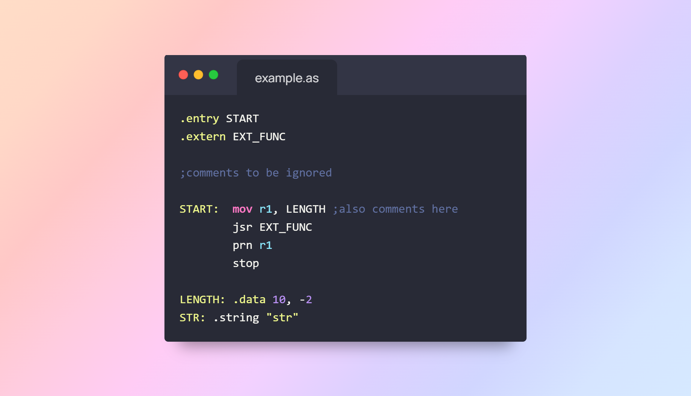
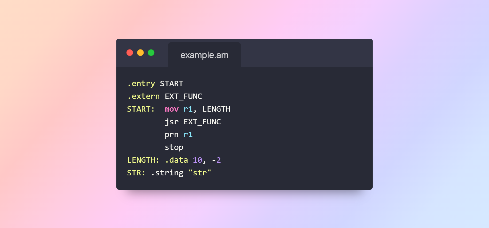
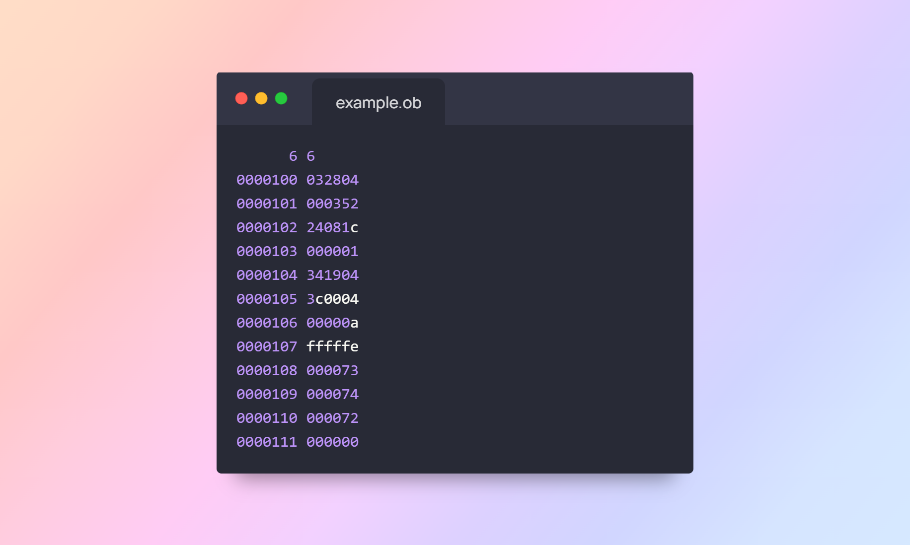

# Assembler Project

## Overview
This project is an assembler for a simplified computer architecture. The assembler takes assembly source files as input, processes them through multiple stages, and generates output files containing machine code, entry labels, and external references.

## Project Structure
The project is organized into the following directories and files:

```
Assembler-C-Labratory/
├── Header_Files/         # Contains header files for modular code structure
├── Images/               # Stores diagrams and relevant images
├── Tests/                # Sample input assembly files
├── LICENSE               # License information
├── Makefile              # Build automation for compiling the assembler
├── README.md             # Documentation of the project
└── Source_Files/         # Core source code of the assembler
```

## Installation

### Prerequisites
Ensure you have the following installed:
- GCC compiler (for compiling the C code)
- Make (for build automation)
- A Linux environment (Ubuntu recommended)

### Compilation
To build the assembler, run:
```sh
make
```
This will compile all source files and generate an executable `assembler`.

## Usage

### Assembler Workflow

```
   .as file
      |
      v
[ Preprocessor ]   -->  .am file (macros expanded)
      |
      v
[ First Pass ]     -->  Symbol table (labels, addresses)
      |
      v
[ Second Pass ]
      |
      v
[ Output Files ]
├── .ob (machine code)
├── .ent (entry labels)
└── .ext (external references)
```

### Sample Input/Output Flow

#### Input Files

| `.as` (Original) | `.am` (Preprocessed) |
|------------------|----------------------|
|  |  |

---

#### Output Files

| `.ob` (Object Code) | `.ent` / `.ext` |
|---------------------|------------------|
|  | <br> |


### Running the Assembler
After compiling, the assembler can be executed with:
```sh
./assembler file1 file2 ...
```
Each input file should be an assembly file (`.as` extension). The assembler processes the files and generates an intermediate `.am` file, which is the source file with comments removed, empty lines eliminated, and macros expanded. It then produces the following output files:
- `.ob` (Object file with machine code)
- `.ent` (Entry labels file)
- `.ext` (External labels file)

### Example
```sh
./assembler example
```
This will generate `example.am`, `example.ob`, `example.ent`, and `example.ext` based on the source assembly file.

## Source Files
The `Source_Files/` directory contains the core implementation of the assembler. The key files are:

### Entry Point
- **assembler.c**: The main entry point of the assembler. It initializes data structures, processes input files, and orchestrates the first and second passes.

### Preprocessing
- **preprocessor.c**: Handles macro expansion and prepares the input for processing.

### First and Second Pass
- **first_pass.c**: Parses the assembly code, identifies labels and errors, and builds the initial symbol table.
- **second_pass.c**: Resolves label addresses, validates references, and generates the final binary output.

### Output Generation
- **output_builder.c**: Generates `.ob`, `.ent`, and `.ext` output files after successful assembly.

### Utility and Error Handling
- **utils.c**: General utility functions for handling strings, memory, and formatting.
- **errors.c**: Defines error messages and reporting functions.
- **globals.c**: Stores global constants and reserved words.
- **label_utils.c**: Functions for label validation and management.
- **command_utils.c**: Parses and validates assembly commands.
- **vpc_utils.c**: Manages memory storage for virtual program execution.

## Header Files
The `Header_Files/` directory contains corresponding header files defining structures and function prototypes. These headers ensure modularity and maintainability.

## Makefile
The `Makefile` automates the compilation process. Key commands:
- `make` – Compiles the project.
- `make clean` – Removes compiled files.

## License
This project is licensed under the MIT License. See the `LICENSE` file for details.


