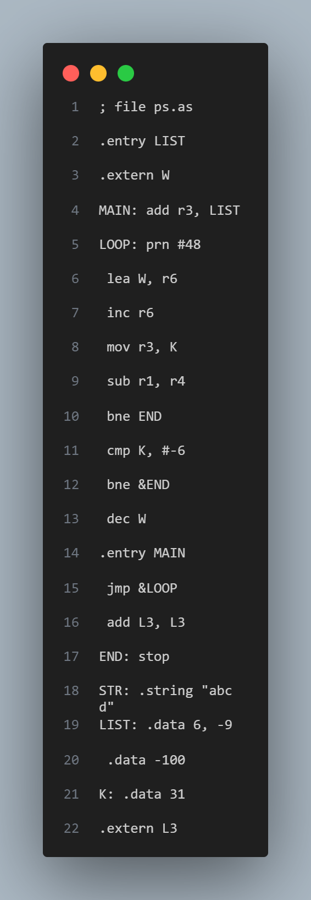
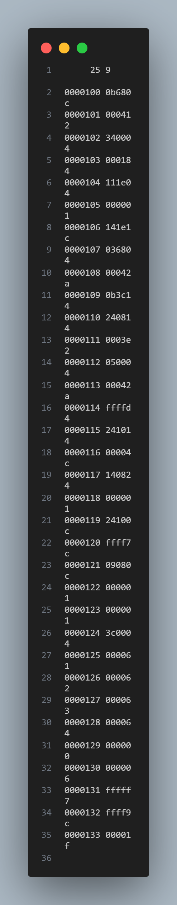

# Assembler Project

## Overview

This project is an assembler for a custom assembly language. It processes assembly source files, handles macros, labels, and directives, and generates machine code output files. The assembler performs two passes over the source files to ensure accurate translation and error handling.

## Features

- **Macro Processing**: Supports defining and expanding macros.
- **Label Handling**: Validates and processes labels, including `.entry` and `.extern` directives.
- **Directive Support**: Handles `.data` and `.string` directives for data storage.
- **Command Validation**: Validates and processes assembly commands.
- **Error Reporting**: Provides detailed error messages for various issues.
- **Output Generation**: Generates `.ob`, `.ent`, and `.ext` files with machine code and label information.

## File Structure

- **Source_Files**: Contains the C source code for the assembler.
  - `assembler.c`: Main entry point for the assembler.
  - `first_pass.c`: Implements the first pass of the assembler.
  - `second_pass.c`: Implements the second pass of the assembler.
  - `preprocessor.c`: Handles macro preprocessing.
  - `first_pass_utils.c`: Utility functions for the first pass.
  - `preprocessor_utils.c`: Utility functions for preprocessing.
  - `label_utils.c`: Utility functions for label handling.
  - `command_utils.c`: Utility functions for command validation.
  - `vpc_utils.c`: Utility functions for virtual PC operations.
  - `utils.c`: General utility functions.
  - `errors.c`: Error handling functions.
  - `output_builder.c`: Functions for generating output files.

- **Header_Files**: Contains the header files for the project.
  - `assembler.h`, `first_pass.h`, `second_pass.h`, `preprocessor.h`, `first_pass_utils.h`, `preprocessor_utils.h`, `label_utils.h`, `command_utils.h`, `vpc_utils.h`, `utils.h`, `errors.h`, `output_builder.h`, `globals.h`, `structs.h`.

- **Inputs**: Contains sample input files for testing the assembler.
  - `test1.as`, `test2.as`: Assembly source files.
  - `test1.am`: Preprocessed assembly file.
  - `test1.ob`, `test1.ent`, `test1.ext`: Output files generated by the assembler.

- **LICENSE**: MIT License for the project.

## Usage

### Compilation

To compile the assembler, use the provided Makefile:

```sh
make
```
### Running the Assembler


To run the assembler on an assembly source file, use the following command:

This will generate the corresponding .ob, .ent, and .ext files in the same directory as the source files.

### Output Files

.ob: Object file containing the machine code.
.ent: Entry file containing entry labels and their addresses.
.ext: Externals file containing external labels and their usage addresses.

### Error Handling
The assembler provides detailed error messages for various issues, including:

Invalid macro names or duplicate macros.
Invalid labels or duplicate labels.
Unknown commands or invalid parameters.
Invalid data or string directives.
Missing or extra text after commands.

### License
This project is licensed under the MIT License. See the LICENSE file for details.

### Contact
For any questions or issues, please contact Shahar Faradyan at [shaharfar16@gmail.com].
